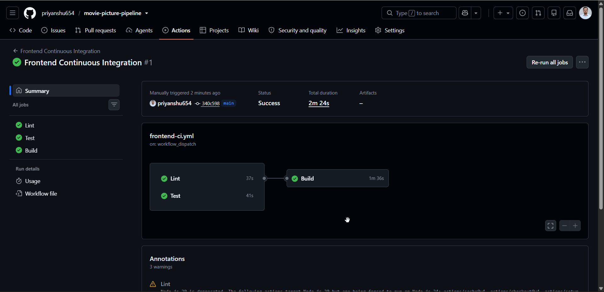
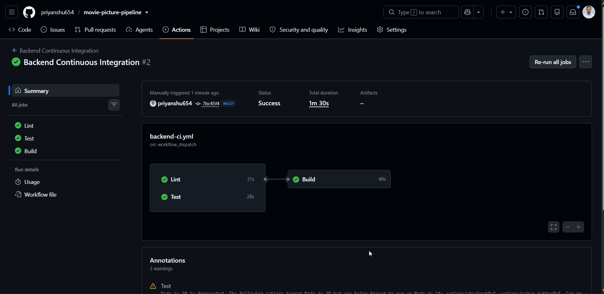
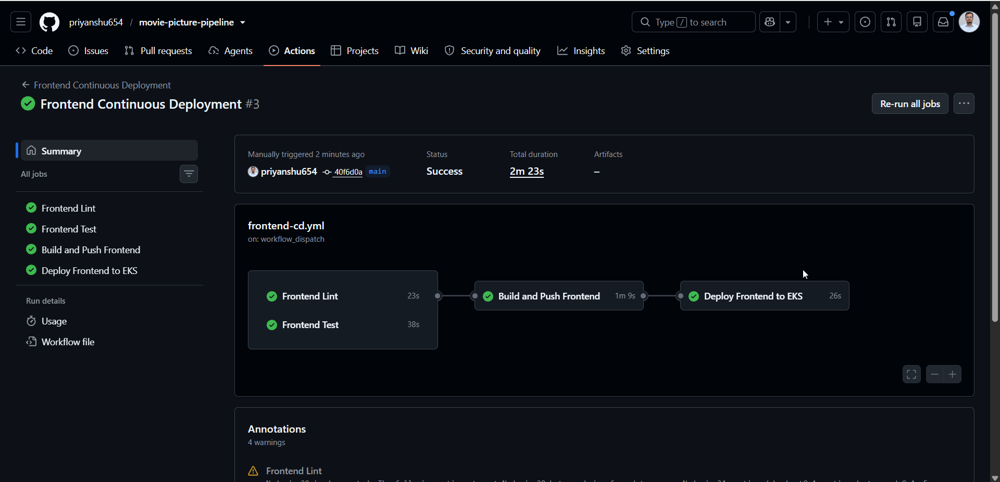
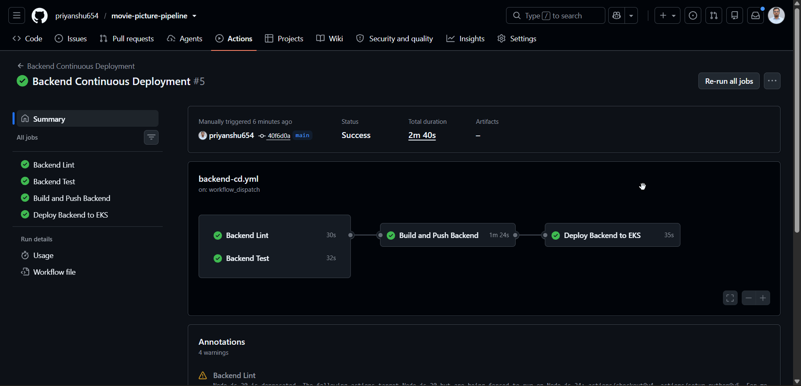
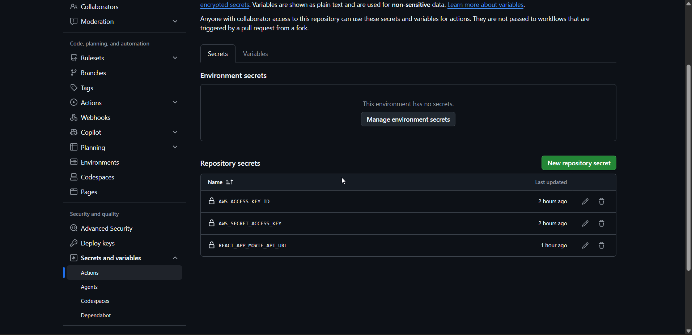
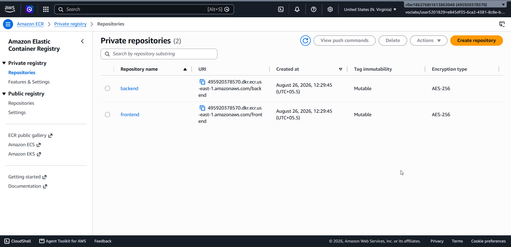
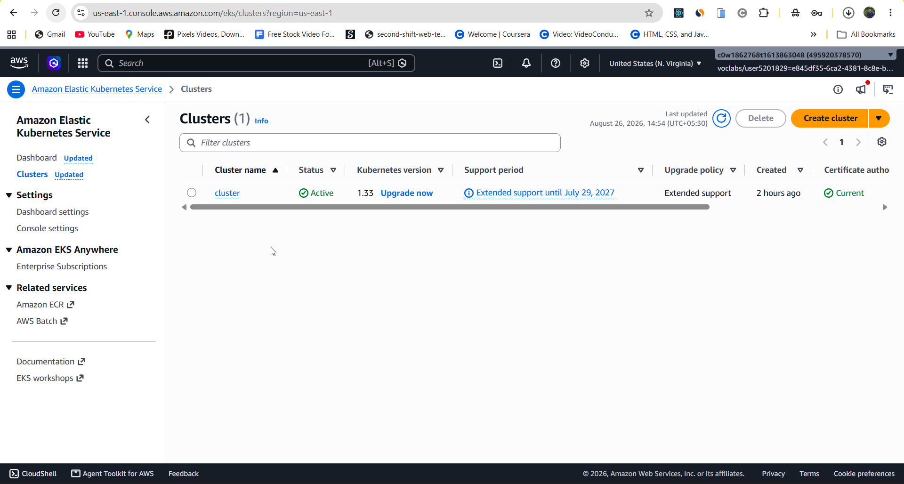
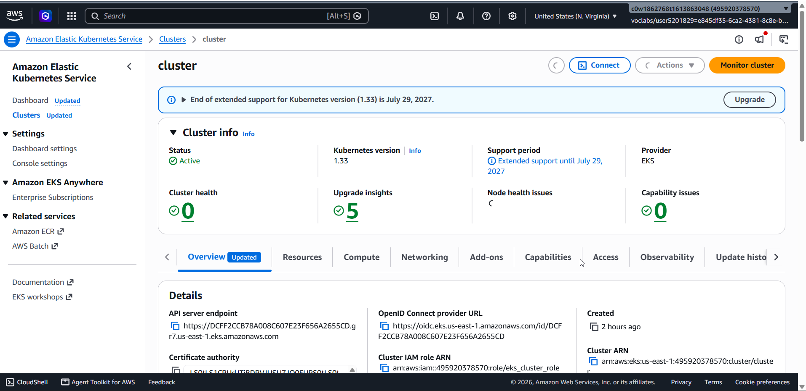
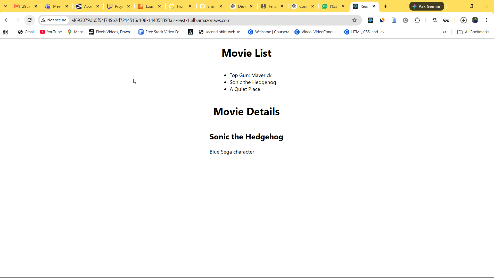
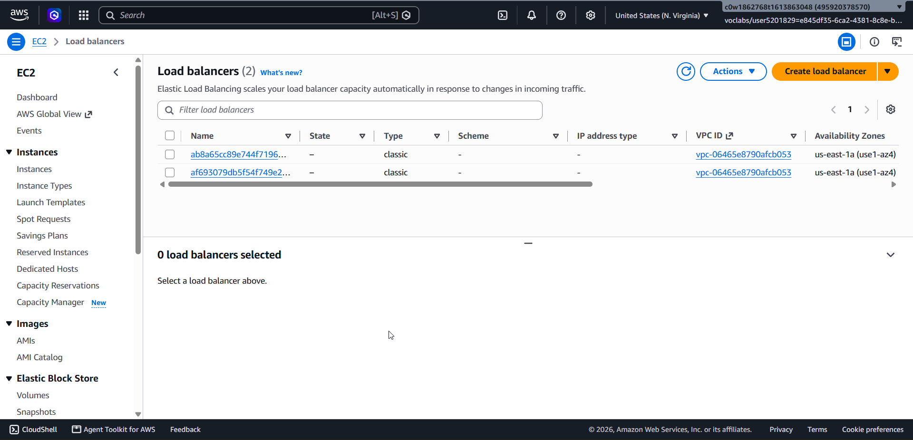

# Movie Picture Pipeline — CI/CD to AWS EKS

**Author:** Priyanshu Raj
**GitHub Repository:** [priyanshu654/movie-picture-pipeline](https://github.com/priyanshu654/movie-picture-pipeline)

This project implements a complete **CI/CD pipeline for a Movie Picture application** using GitHub Actions, Docker, Amazon ECR, Amazon EKS, and Kubernetes.

The application consists of:

* **Frontend:** React application
* **Backend:** Python Flask API
* **Containerization:** Docker
* **Container Registry:** Amazon ECR
* **Orchestration:** Amazon EKS / Kubernetes
* **CI/CD:** GitHub Actions
* **Infrastructure:** AWS

The repository follows the CI/CD requirements of the Movie Picture Pipeline project and automates testing, linting, building, container image creation, publishing, and deployment to Kubernetes.

---

## Architecture

```text
                         ┌──────────────────────┐
                         │       Developer      │
                         │      Git Push / PR   │
                         └──────────┬───────────┘
                                    │
                                    ▼
                         ┌──────────────────────┐
                         │      GitHub          │
                         │   Actions CI/CD      │
                         └──────────┬───────────┘
                                    │
                    ┌───────────────┴───────────────┐
                    │                               │
                    ▼                               ▼
             ┌─────────────┐                 ┌─────────────┐
             │   Frontend  │                 │   Backend   │
             │ React       │                 │ Flask       │
             └──────┬──────┘                 └──────┬──────┘
                    │                               │
                    ▼                               ▼
             ┌─────────────┐                 ┌─────────────┐
             │ Docker      │                 │ Docker      │
             │ Image       │                 │ Image       │
             └──────┬──────┘                 └──────┬──────┘
                    │                               │
                    ▼                               ▼
             ┌────────────────────────────────────────────┐
             │              Amazon ECR                    │
             │                                            │
             │  frontend repository   backend repository  │
             └──────────────────────┬─────────────────────┘
                                    │
                                    ▼
                         ┌──────────────────────┐
                         │     Amazon EKS       │
                         │     Kubernetes       │
                         └──────────┬───────────┘
                                    │
                    ┌───────────────┴───────────────┐
                    │                               │
                    ▼                               ▼
             ┌─────────────┐                 ┌─────────────┐
             │  Frontend   │                 │   Backend   │
             │   Service   │                 │   Service   │
             │ LoadBalancer│                 │ LoadBalancer│
             └─────────────┘                 └─────────────┘
```

---

## AWS Account

| Field        | Value                     |
| ------------ | ------------------------- |
| Account ID   | `495920378570`            |
| Account Name | `c0w1862768t1613863048`   |
| Region       | `us-east-1` (N. Virginia) |

> **Security:** AWS access keys are not stored in this repository. GitHub Actions credentials are stored securely as GitHub repository secrets.

---

## CI/CD Pipeline

The project contains separate CI and CD workflows for the frontend and backend.

### GitHub Actions Workflows

```text
.github/
└── workflows/
    ├── frontend-ci.yaml
    ├── backend-ci.yaml
    ├── frontend-cd.yaml
    └── backend-cd.yaml
```

### Frontend CI

The frontend CI workflow performs:

```text
Lint
  ↓
Test
  ↓
Build
```

It validates the React application before changes are considered ready.



**Figure 1: Frontend CI GitHub Actions workflow**

### Backend CI

The backend CI workflow performs:

```text
Lint
  ↓
Test
  ↓
Build
```

It validates the Flask application and ensures the backend can successfully pass its automated checks.


### Frontend CD

The frontend CD workflow:

1. Runs linting.
2. Runs tests.
3. Builds the React application.
4. Builds the Docker image.
5. Tags the image using the Git commit SHA.
6. Pushes the image to Amazon ECR.
7. Updates the Kubernetes deployment.
8. Deploys the new frontend version to Amazon EKS.


### Backend CD

The backend CD workflow:

1. Runs linting.
2. Runs tests.
3. Builds the Flask application.
4. Builds the Docker image.
5. Tags the image using the Git commit SHA.
6. Pushes the image to Amazon ECR.
7. Updates the Kubernetes deployment.
8. Deploys the new backend version to Amazon EKS.

---

## GitHub Repository Secrets

The GitHub Actions workflows use repository secrets for AWS and application configuration.

Configured secrets include:

```text
AWS_ACCESS_KEY_ID
AWS_SECRET_ACCESS_KEY
REACT_APP_MOVIE_API_URL
```

These values should be configured under:

**GitHub → Repository → Settings → Secrets and variables → Actions**



The AWS credentials belong to the dedicated:

```text
github-action-user
```

IAM user.

> Never commit AWS credentials, `.env` files containing secrets, or access keys to the repository.

---

# Amazon ECR

Two private Amazon ECR repositories are used to store the application images.

### Backend

```text
495920378570.dkr.ecr.us-east-1.amazonaws.com/backend
```

### Frontend

```text
495920378570.dkr.ecr.us-east-1.amazonaws.com/frontend
```

Images are tagged using the Git commit SHA so every deployment can be traced back to a specific source-code version.

Example:

```text
frontend:<git-sha>
backend:<git-sha>
```

This avoids relying on a mutable `latest` tag and makes deployments reproducible.

---


# Amazon EKS

The application is deployed to Amazon Elastic Kubernetes Service.

| Field              | Value       |
| ------------------ | ----------- |
| Cluster Name       | `cluster`   |
| Kubernetes Version | `1.33`      |
| Region             | `us-east-1` |
| Status             | Active      |

The cluster runs the frontend and backend as Kubernetes deployments.

```text
EKS Cluster
│
├── frontend Deployment
│   └── frontend Pod
│
└── backend Deployment
    └── backend Pod
```

---

# Kubernetes Services

Both applications are exposed through Kubernetes `LoadBalancer` services.

### Frontend

```text
Service: frontend
Type: LoadBalancer
Port: 80
TargetPort: 3000
```

### Backend

```text
Service: backend
Type: LoadBalancer
Port: 80
TargetPort: 5000
```

The Kubernetes LoadBalancer services provision AWS load balancers that make the applications accessible externally.

---





# Live Application

## Frontend

**Frontend URL:**

http://af693079db5f54f749e2d7214516c108-144058393.us-east-1.elb.amazonaws.com

The frontend is the React Movie List application.

---

## Backend API

**Backend `/movies` endpoint:**

http://ab8a65cc89e744f71961cf87e85fe911-716410131.us-east-1.elb.amazonaws.com/movies

The backend returns movie data in JSON format.

Example response:

```json
{
  "movies": [
    {
      "id": "123",
      "title": "Top Gun: Maverick"
    },
    {
      "id": "456",
      "title": "Sonic the Hedgehog"
    },
    {
      "id": "789",
      "title": "A Quiet Place"
    }
  ]
}
```

---

# Deployment Flow

A typical deployment follows this process:

```text
Developer pushes code
        │
        ▼
GitHub Actions
        │
        ├── Lint
        ├── Test
        └── Build
        │
        ▼
Docker Image
        │
        ▼
Amazon ECR
        │
        ▼
Kubernetes / EKS
        │
        ▼
Deployment Updated
        │
        ▼
New Pod Created
        │
        ▼
Application Available
```

The Docker image is tagged using the Git SHA associated with the deployment.

For example:

```text
495920378570.dkr.ecr.us-east-1.amazonaws.com/frontend:<commit-sha>
```

and:

```text
495920378570.dkr.ecr.us-east-1.amazonaws.com/backend:<commit-sha>
```

---

# Kubernetes Deployment Verification

The following commands can be used to verify the deployment.

### Check Pods

```bash
kubectl get pods -o wide
```

Expected result:

```text
NAME                         READY   STATUS
backend-xxxxx-xxxxx          1/1     Running
frontend-xxxxx-xxxxx         1/1     Running
```

### Check Services

```bash
kubectl get svc
```

Expected services:

```text
NAME         TYPE           EXTERNAL-IP
backend      LoadBalancer   <backend-elb>
frontend     LoadBalancer   <frontend-elb>
kubernetes   ClusterIP      <none>
```

### Check Deployments

```bash
kubectl get deployments
```

### Check Nodes

```bash
kubectl get nodes -o wide
```

### Check Frontend Endpoint

```bash
kubectl get endpoints frontend
```

### Check Backend Endpoint

```bash
kubectl get endpoints backend
```

---

# Useful Kubernetes Commands

### View frontend logs

```bash
kubectl logs deployment/frontend
```

### View backend logs

```bash
kubectl logs deployment/backend
```

### Describe frontend service

```bash
kubectl describe svc frontend
```

### Describe backend service

```bash
kubectl describe svc backend
```

### View all resources

```bash
kubectl get all
```

---

# Project Structure

```text
movie-picture-pipeline/
│
├── .github/
│   └── workflows/
│       ├── frontend-ci.yaml
│       ├── backend-ci.yaml
│       ├── frontend-cd.yaml
│       └── backend-cd.yaml
│
├── setup/
│   ├── init-windows.ps1
│   ├── init.sh
│   ├── workspace-setup.sh
│   └── terraform/
│
├── starter/
│   ├── backend/
│   │   ├── k8s/
│   │   ├── movies/
│   │   ├── Dockerfile
│   │   ├── Pipfile
│   │   └── ...
│   │
│   └── frontend/
│       ├── k8s/
│       ├── public/
│       ├── src/
│       ├── Dockerfile
│       ├── package.json
│       └── ...
│
├── CODEOWNERS
├── LICENSE.md
└── README.md
```

---

# Local Development

## Frontend

```bash
cd starter/frontend

npm ci
npm start
```

The frontend can be accessed locally at:

```text
http://localhost:3000
```

The backend API URL can be configured using:

```text
REACT_APP_MOVIE_API_URL
```

---

## Backend

```bash
cd starter/backend

pipenv install
pipenv run serve
```

The backend runs on:

```text
http://localhost:5000
```

Test the API:

```bash
curl http://localhost:5000/movies
```

---

# Docker

## Build Frontend

```bash
cd starter/frontend

docker build \
  --build-arg REACT_APP_MOVIE_API_URL=<BACKEND_URL> \
  --tag mp-frontend:latest .
```

Run:

```bash
docker run --name mp-frontend -p 3000:3000 -d mp-frontend
```

---

## Build Backend

```bash
cd starter/backend

docker build --tag mp-backend:latest .
```

Run:

```bash
docker run --name mp-backend -p 5000:5000 -d mp-backend
```

Test:

```bash
curl http://localhost:5000/movies
```

---

# Infrastructure Setup

The project includes Terraform configuration under:

```text
setup/terraform/
```

Terraform is used to provision the AWS infrastructure required for the deployment environment.

Typical commands:

```bash
cd setup/terraform

terraform init
terraform plan
terraform apply
```

After the infrastructure has been created, the Kubernetes cluster can be accessed using AWS CLI:

```bash
aws eks update-kubeconfig \
  --name cluster \
  --region us-east-1
```

Verify the connection:

```bash
kubectl get nodes
```

---

# GitHub Actions → AWS Authentication

A dedicated IAM user is used by GitHub Actions:

```text
github-action-user
```

The IAM user is configured with EKS access through an **EKS Access Entry** and the appropriate cluster access policy.

The deployment workflow can therefore authenticate to AWS, access ECR, and interact with the EKS cluster.

The authentication flow is:

```text
GitHub Actions
      │
      ▼
AWS IAM
      │
      ▼
ECR
      │
      ▼
EKS Access
      │
      ▼
Kubernetes
```

---

# CI/CD Benefits

This implementation provides several DevOps benefits:

* Automated code validation
* Automated linting
* Automated testing
* Automated application builds
* Docker image creation
* Centralized container storage in ECR
* Git SHA based image versioning
* Automated Kubernetes deployments
* Reproducible deployments
* Reduced manual deployment effort
* Clear separation between CI and CD
* AWS-based production-style infrastructure

---

# Technologies Used

| Technology              | Purpose                          |
| ----------------------- | -------------------------------- |
| React                   | Frontend UI                      |
| TypeScript / JavaScript | Frontend development             |
| Python                  | Backend development              |
| Flask                   | Backend REST API                 |
| Docker                  | Containerization                 |
| GitHub Actions          | CI/CD automation                 |
| Amazon ECR              | Container image registry         |
| Amazon EKS              | Kubernetes cluster               |
| Kubernetes              | Application orchestration        |
| Kustomize               | Kubernetes manifest management   |
| Terraform               | Infrastructure provisioning      |
| AWS IAM                 | Authentication and authorization |
| AWS Load Balancer       | External application access      |
| Git                     | Version control                  |
| GitHub                  | Source code and CI/CD            |

---

# Key DevOps Practices Demonstrated

### Continuous Integration

Every change can be validated through automated:

```text
Lint → Test → Build
```

### Continuous Deployment

Successful builds can progress through:

```text
Build
  ↓
Docker Image
  ↓
ECR
  ↓
EKS
  ↓
Running Application
```

### Immutable Image Versioning

Images are tagged with the Git commit SHA instead of relying exclusively on `latest`.

This makes it possible to identify exactly which source revision is running in Kubernetes.

### Infrastructure as Code

Terraform configuration is maintained in the repository so the infrastructure can be recreated when required.

### Containerized Deployment

Both frontend and backend applications are packaged as Docker containers and deployed independently.

---

# Verification

The deployment can be verified at three levels.

### 1. GitHub Actions

Confirm that the CI/CD workflows complete successfully.

### 2. Kubernetes

```bash
kubectl get pods
kubectl get svc
kubectl get deployments
```

### 3. Application

Frontend:

```text
http://af693079db5f54f749e2d7214516c108-144058393.us-east-1.elb.amazonaws.com
```

Backend:

```text
http://ab8a65cc89e744f71961cf87e85fe911-716410131.us-east-1.elb.amazonaws.com/movies
```

---

# Troubleshooting

### Check frontend logs

```bash
kubectl logs deployment/frontend --tail=100
```


### Check backend logs

```bash
kubectl logs deployment/backend --tail=100
```

### Check frontend service

```bash
kubectl describe svc frontend
```

### Check backend service

```bash
kubectl describe svc backend
```

### Check running pods

```bash
kubectl get pods -o wide
```

### Check endpoints

```bash
kubectl get endpoints frontend
kubectl get endpoints backend
```

If a frontend page loads but the movie list does not appear, verify that `REACT_APP_MOVIE_API_URL` points to the **complete backend URL**, including the protocol and endpoint expected by the application.

For example:

```text
http://<backend-load-balancer>/movies
```

After changing a React environment variable used during the build, the frontend image must be rebuilt and redeployed because React environment variables are embedded into the production JavaScript during the build process.

---

# Conclusion

The Movie Picture Pipeline demonstrates an end-to-end DevOps workflow for deploying a full-stack application to AWS.

The final deployment connects:

```text
GitHub
   ↓
GitHub Actions
   ↓
Docker
   ↓
Amazon ECR
   ↓
Amazon EKS
   ↓
Kubernetes
   ↓
AWS Load Balancers
   ↓
React + Flask Application
```

This project demonstrates practical experience with **CI/CD, Docker, Kubernetes, AWS ECR, AWS EKS, IAM, Terraform, GitHub Actions, and automated cloud deployments**.

---

## Author

**Priyanshu Raj**

GitHub: [priyanshu654](https://github.com/priyanshu654)

Repository: [movie-picture-pipeline](https://github.com/priyanshu654/movie-picture-pipeline)
